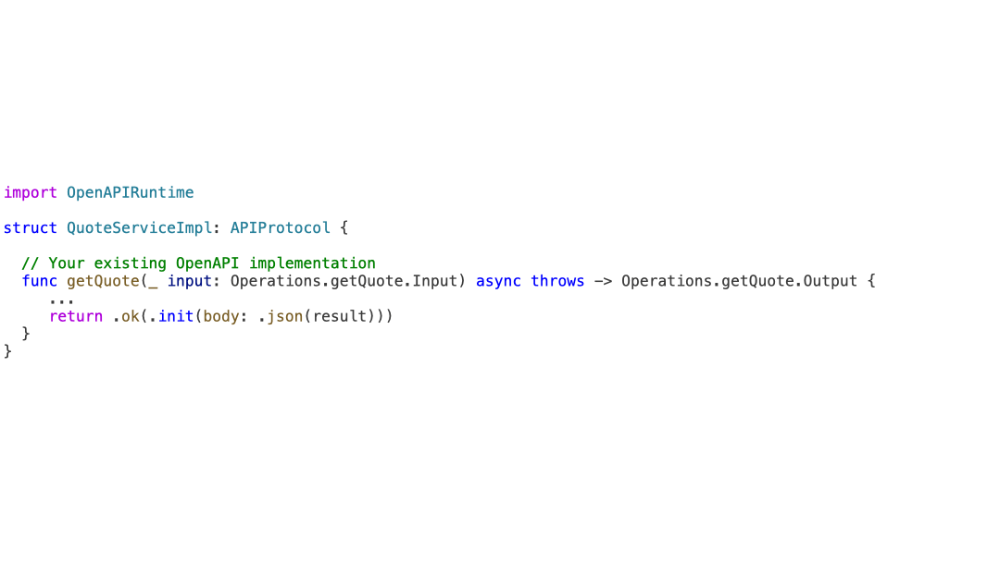

#  AWS Lambda transport for Swift OpenAPI

This library provides an [AWS Lambda](https://docs.aws.amazon.com/lambda/latest/dg/welcome.html) transport for [Swift OpenAPI generator](https://github.com/apple/swift-openapi-generator)

This library allows to expose server side Swift OpenAPI implementation generated by the Swift OpenAPI generator as an AWS Lambda function.

The library provides two capabilities:

- a default implementation of an AWS Lambda function in that consumes your OpenAPI service implementation
- a binding with the [Amazon API Gateway (HTTP API mode)](https://docs.aws.amazon.com/apigateway/latest/developerguide/http-api.html) (aka `APIGatewayV2`) event type.

Other Lambda function bindings (event types) are supported as well, depending on your needs. [We include instructions](#implement-your-own-openapilambda-to-support-other-event-types) to create a binding with an [Amazon API Gateway (REST API mode)](https://docs.aws.amazon.com/apigateway/latest/developerguide/apigateway-rest-api.html)

## Prerequisites

To write and deploy AWS Lambda functions based on an OpenAPI API definition, you need the following:

- an [AWS Account](https://console.aws.amazon.com/)
- the [AWS Command Line Interface (AWS CLI)](https://docs.aws.amazon.com/cli/latest/userguide/cli-chap-getting-started.html) - install the CLI and [configure](https://docs.aws.amazon.com/cli/latest/userguide/cli-configure-quickstart.html) it with credentials to your AWS account
- the [AWS SAM CLI](https://docs.aws.amazon.com/serverless-application-model/latest/developerguide/install-sam-cli.html) - a command-line tool used to create serverless workloads on AWS
- the [Docker Desktop](https://www.docker.com/products/docker-desktop/) - to compile your Swift code for Linux deployment to AWS Lambda

## TL;DR 

If you already have an OpenAPI definition, you already generated the server stubs, and wrote an implementation, here are the additional steps to expose your OpenAPI service implementation as a AWS Lambda function and an Amazon API Gateway HTTP API (aka `APIGatewayV2`).

If you don't know how to start, read the next section, there is [a tutorial with step-by-step instructions](#tutorial-a-quick-start-with-a-stock-quote-api-service-example).

To expose your OpenAPI implementation as an AWS Lambda function:

1. Add the dependency to your `Package.swift`

   The project dependencies:

```swift
  dependencies: [
    .package(url: "https://github.com/apple/swift-openapi-generator.git", .upToNextMinor(from: "1.0.0-alpha.1")),
    .package(url: "https://github.com/apple/swift-openapi-runtime.git", .upToNextMinor(from: "1.0.0")),
    .package(url: "https://github.com/swift-server/swift-aws-lambda-runtime.git", branch: "1.0.0-alpha.1"),
    .package(url: "https://github.com/swift-server/swift-aws-lambda-events.git", branch: "main"),
    .package(url: "https://github.com/sebsto/swift-openapi-lambda", branch: "main") 
  ],
```

   The target dependencies:

```swift
    .executableTarget(
      name: "YourOpenAPIService",
      dependencies: [
        .product(name: "AWSLambdaRuntime", package: "swift-aws-lambda-runtime"),
        .product(name: "AWSLambdaEvents", package: "swift-aws-lambda-events"),
        .product(name: "OpenAPIRuntime",package: "swift-openapi-runtime"),
        .product(name: "OpenAPILambda",package: "swift-openapi-lambda"),
      ],
```

2. Add a protocol and a constructor to your existing OpenAPI service implementation 



There are only four changes to make to your existing implementation:

```swift
import Foundation
import OpenAPIRuntime
import OpenAPILambda // <-- 1. import this library 

@main // <-- 2. flag this struct as the executable target entrypoint
struct QuoteServiceImpl: APIProtocol, OpenAPILambdaHttpApi { // <-- 3. add the OpenAPILambdaHttpApi protocol 

  init(transport: OpenAPILambdaTransport) throws { // <-- 4. add this constructor (don't remove the call to `registerHandlers(on:)`)
    try self.registerHandlers(on: transport)
  }

  // the rest below is unmodified 

  func getQuote(_ input: Operations.getQuote.Input) async throws -> Operations.getQuote.Output {

    let symbol = input.path.symbol

    let price = Components.Schemas.quote(
        symbol: symbol,
        price: Double.random(in: 100..<150).rounded(),
        change: Double.random(in: -5..<5).rounded(),
        changePercent: Double.random(in: -0.05..<0.05),
        volume: Double.random(in: 10000..<100000).rounded(),
        timestamp: Date())

    return .ok(.init(body: .json(price)))
  }
}

```

3. Package and deploy your Lambda function + create an HTTP API Gateway (aka `APIGatewayV2`)

🎉 Enjoy!

## Tutorial (a Quick Start with a Stock Quote API service example)

### Part 1 - the code

1. Create a Swift executable project 

```sh
mkdir quoteapi && cd quoteapi
swift package init --name quoteapi --type executable
```

2. Write or import an OpenAI API definition in YAML or JSON 

```yaml
#
# the $ signs are escaped (\$) to work with the cat << EOF command
# if you choose to copy the content directly to a text editor,
# be sure to remove the \ (that means \$ becomes $)
#

cat << EOF > Sources/openapi.yaml
openapi: 3.1.0
info:
  title: StockQuoteService
  version: 1.0.0
  
components:
  schemas:
    quote:
      type: object
      properties:
        symbol:
          type: string
        price:
          type: number
        change:
          type: number
        changePercent:
          type: number
        volume:
          type: number
        timestamp:
          type: string
          format: date-time
          
paths:
  /stocks/{symbol}:
    get:
      summary: Get the latest quote for a stock
      operationId: getQuote
      parameters:
        - name: symbol
          in: path
          required: true
          schema:
            type: string
      tags:
        - stocks
      responses:
        200:
          description: OK
          content:
            application/json:
              schema:
                \$ref: '#/components/schemas/quote'
        400:
          description: Bad Request
        404:
          description: Not Found
EOF
```

3. Add a Swift OpenAPI generator configuration file to generate only the server side 

```sh
cat << EOF > Sources/openapi-generator-config.yaml
generate:
  - types
  - server
EOF
```

4. Use this `Package.swift` file to define targets and their dependencies

```sh
cat << EOF > Package.swift
// swift-tools-version: 5.9
// The swift-tools-version declares the minimum version of Swift required to build this package.

import PackageDescription

let package = Package(
  name: "QuoteService",
  platforms: [
    .macOS(.v13), .iOS(.v15), .tvOS(.v15), .watchOS(.v6),
  ],
  products: [
    .executable(name: "QuoteService", targets: ["QuoteService"]),
  ],
  dependencies: [
    .package(url: "https://github.com/apple/swift-openapi-generator.git", .upToNextMinor(from: "1.0.0")),
    .package(url: "https://github.com/apple/swift-openapi-runtime.git", .upToNextMinor(from: "1.0.0")),
    .package(url: "https://github.com/swift-server/swift-aws-lambda-runtime.git", branch: "1.0.0-alpha.1"),
    .package(url: "https://github.com/swift-server/swift-aws-lambda-events.git", branch: "main"),
    .package(url: "https://github.com/sebsto/swift-openapi-lambda", branch: "main") 
  ],
  targets: [
    .executableTarget(
      name: "QuoteService",
      dependencies: [
        .product(name: "AWSLambdaRuntime", package: "swift-aws-lambda-runtime"),
        .product(name: "AWSLambdaEvents", package: "swift-aws-lambda-events"),
        .product(name: "OpenAPIRuntime",package: "swift-openapi-runtime"),
        .product(name: "OpenAPILambda",package: "swift-openapi-lambda"),
      ],
      path: "Sources",
      resources: [ 
        .copy("openapi.yaml"),
        .copy("openapi-generator-config.yaml")
      ],
      plugins: [
        .plugin(
            name: "OpenAPIGenerator",
            package: "swift-openapi-generator"
        )
      ]  
    ),
  ]
)
EOF
```

5. Generate server side Swift stub of the OpenAPI API definition

```sh
swift build
```

6. Replace `main.swift` with your own implementation 

```sh
rm Sources/main.swift
cat << EOF > Sources/QuoteService.swift
import Foundation
import OpenAPIRuntime
import OpenAPILambda

@main
struct QuoteServiceImpl: APIProtocol, OpenAPILambdaHttpApi {

  init(transport: OpenAPILambdaTransport) throws {
    try self.registerHandlers(on: transport)
  }

  func getQuote(_ input: Operations.getQuote.Input) async throws -> Operations.getQuote.Output {

    let symbol = input.path.symbol

    let price = Components.Schemas.quote(
        symbol: symbol,
        price: Double.random(in: 100..<150).rounded(),
        change: Double.random(in: -5..<5).rounded(),
        changePercent: Double.random(in: -0.05..<0.05),
        volume: Double.random(in: 10000..<100000).rounded(),
        timestamp: Date())

    return .ok(.init(body: .json(price)))
  }
}
EOF
```

7. Build the project to ensure everything works

```sh
swift build
```

### Part 2 - the deployment

1. Add the Lambda build instructions as a Docker file and a Makefile. We build for Swift 5.9 on Amazon Linux 2

```sh
#
# the $ signs are escaped (\$) to work with the cat << EOF command
# if you choose to copy the content directly to a text editor,
# be sure to remove the \ (that means \$ becomes $)
#

cat << EOF > Dockerfile
# image used to compile your Swift code
FROM public.ecr.aws/docker/library/swift:5.9.1-amazonlinux2
RUN yum -y install git jq tar zip openssl-devel
EOF

cat << EOF > Makefile
### Add functions here and link them to builder-bot format MUST BE "build-FunctionResourceName in template.yaml"

build-QuoteService: builder-bot

# Helper commands
deploy:
	sam deploy 

logs:
	sam logs --stack-name QuoteService --name QuoteService 

tail:
	sam logs --stack-name QuoteService --name QuoteService --tail

######################  No Change required below this line  ##########################

builder-bot:
	\$(eval \$@PRODUCT = \$(subst build-,,\$(MAKECMDGOALS)))
	\$(eval \$@BUILD_DIR = \$(PWD)/.aws-sam/build-swift)
	\$(eval \$@STAGE = \$(\$@BUILD_DIR)/lambda)
	\$(eval \$@ARTIFACTS_DIR = \$(PWD)/.aws-sam/build/\$(\$@PRODUCT))
	
	# build docker image to compile Swift for Linux
	docker build -f Dockerfile . -t swift-builder

	# prep directories
	mkdir -p \$(\$@BUILD_DIR)/lambda \$(\$@ARTIFACTS_DIR)

	# compile application inside Docker image using source code from local project folder
	docker run --rm -v \$(\$@BUILD_DIR):/build-target -v \`pwd\`:/build-src -w /build-src swift-builder bash -cl "swift build --static-swift-stdlib --product \$(\$@PRODUCT) -c release --build-path /build-target"
	
	# create lambda bootstrap file
	docker run --rm -v \$(\$@BUILD_DIR):/build-target -v \`pwd\`:/build-src -w /build-src swift-builder bash -cl "cd /build-target/lambda && ln -s \$(\$@PRODUCT) /bootstrap"
  
	# copy binary to stage
	cp \$(\$@BUILD_DIR)/release/\$(\$@PRODUCT) \$(\$@STAGE)/bootstrap
  
  	# copy app from stage to artifacts dir
	cp \$(\$@STAGE)/* \$(\$@ARTIFACTS_DIR)
   
EOF
```

2. Add a SAM template to deploy the Lambda function and the API Gateway

```sh
#
# the $ signs are escaped (\$) to work with the cat << EOF command
# if you choose to copy the content directly to a text editor,
# be sure to remove the \ (that means \$ becomes $)
#

cat << EOF > template.yml
AWSTemplateFormatVersion: '2010-09-09'
Transform: AWS::Serverless-2016-10-31
Description: SAM Template for QuoteService

Globals:
  Function:
    Timeout: 60
    CodeUri: .
    Handler: swift.bootstrap
    Runtime: provided.al2
    MemorySize: 512
    Architectures:
      - arm64

Resources:
  # Lambda function
  QuoteService:
    Type: AWS::Serverless::Function
    Properties:
      Events:
        # handles all GET / method of the REST API
        Api:
          Type: HttpApi
    Metadata:
      BuildMethod: makefile

# print API endpoint and name of database table
Outputs:
  SwiftAPIEndpoint:
    Description: "API Gateway endpoint URL for your application"
    Value: !Sub "https://\${ServerlessHttpApi}.execute-api.\${AWS::Region}.amazonaws.com"
EOF
```

3. Build the Lambda function executable for Amazon Linux 2

```sh
sam build
```

4. Deploy the Lambda function and create an API Gateway in front of it

```sh
# use --guided for the first deployment only.
# SAM cli collects a few parameters and store them in `samconfig.toml`

sam deploy --guided --stack-name QuoteService
```

Accept all the default values, except:

```sh
QuoteService has no authentication. Is this okay? [y/N]: <-- answer Y here 
```

This command outputs the URL of the API Gateway, for example:

```sh
Outputs                                                                                                                     
-----------------------------------------------------------------------------------------------------------------------------
Key                 SwiftAPIEndpoint                                                                                        
Description         API Gateway endpoint URL for your application                                                           
Value               https://747ukfmah7.execute-api.us-east-1.amazonaws.com                                                  
-----------------------------------------------------------------------------------------------------------------------------
```

5. Test your setup

```sh
curl [[ Replace with SWIFTAPIEndpoint value ]]/stocks/AAPL
{
  "change" : -4,
  "changePercent" : -0.030052760210257923,
  "price" : 111,
  "symbol" : "AAPL",
  "timestamp" : "2023-12-13T03:12:35Z",
  "volume" : 63812
}
```

## Deployment costs

On new AWS accounts, there is no costs associated with the deployment and test of this sample code, up to 1 million invocation per month. It falls under the permananet AWS free Tier for [AWS Lambda](https://aws.amazon.com/lambda/pricing/) and [Amazon API Gateway](https://aws.amazon.com/api-gateway/pricing/)

When you're account is older than a year, you are charged $1.0 per million calls to the API Gateway. AWS Lambda function invocation stays free up to 4 million invocations and 400.000 GB-second compute time per month.

## Cleanup 

To delete the AWS Lambda function, the API Gateway, and the roles and permissions created with `sam`, just type:

```sh
sam delete
```

## Local Testing 

```
git clone https://github.com/sebsto/swift-openapi-lambda.git && cd swift-openapi-lambda
# In the directory of the Swift OpenAPI Lambda transport project
LOCAL_LAMBDA_SERVER_ENABLED=true swift run 

# from another terminal, in the directory of the QuoteAPI sample project
curl -v -X POST --header "Content-Type: application/json" --data @events/GetQuote.json  http://127.0.0.1:7000/invoke
```

## Implement your own `OpenAPILambda` to support other AWS Lambda event types

When you expose your AWS Lambda function to other event types, you have to specialize the `OpenAPILambda` protocol and implement the two methods that transform your Lambda function input data to an `OpenAPIRequest` and the other way around, transform an `OpenAPIResponse` to your Lambda function output type.

Here is an example with the [Amazon API Gateway (Rest Api)](https://docs.aws.amazon.com/apigateway/latest/developerguide/apigateway-rest-api.htm), (aka the original API Gateway).

I start with an OpenAPI stub implementation - unmodified.

```swift
import Foundation
import OpenAPIRuntime

struct QuoteServiceImpl: APIProtocol {
  func getQuote(_ input: Operations.getQuote.Input) async throws -> Operations.getQuote.Output {

    let symbol = input.path.symbol

    let price = Components.Schemas.quote(
        symbol: symbol,
        price: Double.random(in: 100..<150).rounded(),
        change: Double.random(in: -5..<5).rounded(),
        changePercent: Double.random(in: -0.05..<0.05),
        volume: Double.random(in: 10000..<100000).rounded(),
        timestamp: Date())

    return .ok(.init(body: .json(price)))
  }
}
```

Next, I implement a `struct` that conforms to `OpenAPILambda`. This `struct` defines:

-  the event input and output the Lambda function will work on (from [AWS Lambda Event Types](https://github.com/swift-server/swift-aws-lambda-events) library).
- the mandatory constructor `init(transport:)`
- the executable target entrypoint (`@main`)

Here is an example using `APIGatewayRequest` and `APIGatewayResponse`:

```swift
@main
struct QuoteServiceLambda: OpenAPILambda {
  typealias Event = APIGatewayRequest
  typealias Output = APIGatewayResponse
  public init(transport: OpenAPILambdaTransport) throws {
    let openAPIHandler = QuoteServiceImpl()
    try openAPIHandler.registerHandlers(on: transport)
  }
}
```

Next step is to implement two methods from `OpenAPILambda` protocol to convert your Lambda function input data (`APIGatewayRequest`) to an `OpenAPIRequest` and the other way around, transform an `OpenAPIResponse` to your Lambda function output type (`APIGatewayResponses`).

```swift
extension OpenAPILambda where Event == APIGatewayRequest {
    /// Transform a Lambda input (`APIGatewayRequest` and `LambdaContext`) to an OpenAPILambdaRequest (`HTTPRequest`, `String?`)
    public func request(context: LambdaContext, from request: Event) throws -> OpenAPILambdaRequest {
        (try request.httpRequest(), request.body)
    }
}

extension OpenAPILambda where Output == APIGatewayResponse {
    /// Transform an OpenAPI response (`HTTPResponse`, `String?`) to a Lambda Output (`APIGatewayResponse`)
    public func output(from response: OpenAPILambdaResponse) -> Output {
        var apiResponse = APIGatewayResponse(from: response.0)
        apiResponse.body = response.1
        return apiResponse
    }
}
```

To keep the above code short, simple, and readable, we suggest to implement whatever extension on the Lambda event type.  Here are the extensions required to support the above code. These are simple data transformation methods from one type to the other.

```swift
extension APIGatewayRequest {
    
    /// Return an `HTTPRequest.Method` for this `APIGatewayRequest`
    public func httpRequestMethod() throws -> HTTPRequest.Method {
        guard let method = HTTPRequest.Method(rawValue: self.httpMethod.rawValue) else {
            throw OpenAPILambdaHttpError.invalidMethod(self.httpMethod.rawValue)
        }
        return method
    }

    /// Return an `HTTPRequest` for this `APIGatewayV2Request`
    public func httpRequest() throws -> HTTPRequest {
        try HTTPRequest(
            method: self.httpRequestMethod(),
            scheme: "https",
            authority: "",
            path: self.path,
            headerFields: self.headers.httpFields()
        )
    }
}

extension APIGatewayResponse {
    
    /// Create a `APIGatewayV2Response` from an `HTTPResponse`
    public init(from response: HTTPResponse) {
        self = APIGatewayResponse(
            statusCode: .init(code: UInt(response.status.code)),
            headers: .init(from: response.headerFields),
            isBase64Encoded: false
        )
    }
}
```

You can apply the same design to support other AWS Lambda event types. However, keep in mind that the `OpenAPILAmbda` implementation is heavily biased towards receiving, routing, and responding to HTTP requests. 

## References 

### Swift OpenAPI generator

To get started with the Swift OpenAPI generator, check out the full [documentation](https://swiftpackageindex.com/apple/swift-openapi-generator/documentation), which contains [a step-by-step tutorial](https://swiftpackageindex.com/apple/swift-openapi-generator/0.3.5/tutorials/swift-openapi-generator).


### Swift on AWS Lambda 

The Swift Runtime for AWS Lambda allows you to write AWS Lambda functions in the Swift programming language.

To get started, check out [this step-by-step tutorial](https://swiftpackageindex.com/swift-server/swift-aws-lambda-runtime/main/tutorials/table-of-content) and [the documentation](https://swiftpackageindex.com/swift-server/swift-aws-lambda-runtime).

### Serverless Application Model (SAM) 

Read "[What is SAM](https://docs.aws.amazon.com/serverless-application-model/latest/developerguide/what-is-sam.html)" to understand and get started with SAM.
